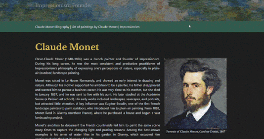

# :art: Static Webpage about Monet

 

This repository contains a static webpage about Monet and his work. It was created to study the basis of **HTML** and **CSS**. Originally, the project was created in the Autumn of 2024. This is an updated version.

**The preview:**

   

